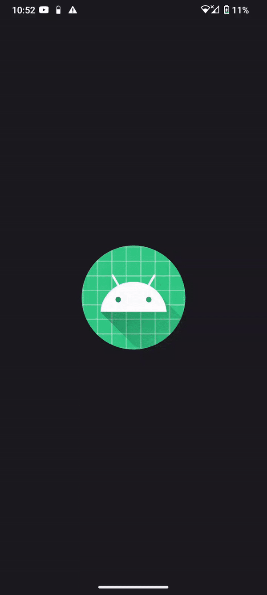
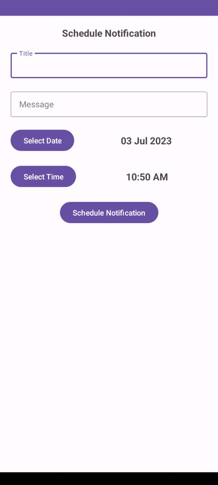
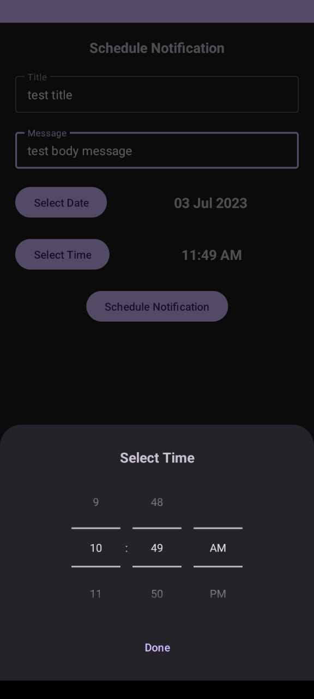

# Schedule Local Notification

This Android Notification Scheduler Example is a simple demonstration of how to schedule notifications within an Android application. The project showcases the implementation of scheduled notifications using the AlarmManager and BroadcastReceiver classes.

## Key Features:
App implements "Single Activity - multiple Fragments" navigation pattern.

- Schedule and send notifications at a specified date and time.
- Utilize the AlarmManager to trigger notifications even when the device is in idle mode.
- Showcase the use of PendingIntent to handle notification actions upon user interaction.
- Illustrate how to create and manage notification channels for Android versions Oreo (API level 26) and above.

Android Jetpack Architecture Components used:
- Kotlin
- ViewBinding 
- Navigation component

UI is utilising a dual-theme approach, This app automatically switches between light and dark themes based on the user's mobile phone theme.

Project uses third-party libraries:
- [Timber](https://github.com/JakeWharton/timber) logging
- [Android-Viewbinding](https://github.com/yogacp/android-viewbinding) for viewbinding

## License
Licensed under the [GNU General Public License v3.0](LICENSE)
